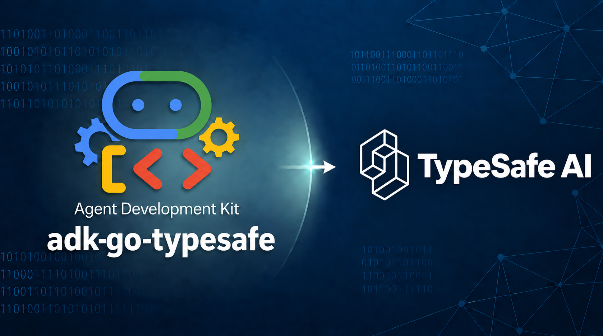

<p align="center">
  
</p>

# adk-go-typesafe

[TypeSafe AI](https://typesafe.ai/) System One integration for [adk-go](https://github.com/google/adk-go), bringing Choice, Score, and Noul primitives to Go agents and workflows with models such as [Jev](https://typesafe.ai/blog/introducing-system-one-models-and-jev).

Provides a typed HTTP client, ADK function tool, classification and routing agent, and assessment callbacks. The client is a temporary bridge until TypeSafe publishes a Go SDK; its API types are generated from TypeSafe's OpenAPI schema.

**Other providers:** [adk-go-bedrock](https://github.com/craigh33/adk-go-bedrock) · [adk-go-ollama](https://github.com/craigh33/adk-go-ollama) · [adk-go-kronk](https://github.com/craigh33/adk-go-kronk)

## Requirements

- **Go**: match [`go.mod`](go.mod).
- Live examples will require a **TypeSafe API key** (`TYPESAFE_API_KEY`); see the [TypeSafe quick start](https://docs.typesafe.ai/introduction/quickstart).

## Install

```bash
go get github.com/craigh33/adk-go-typesafe
```

## Usage

```go
import "github.com/craigh33/adk-go-typesafe/typesafe"

client, err := typesafe.New(nil) // Reads TYPESAFE_API_KEY.
if err != nil {
    return err
}

response, err := client.Evaluate(ctx, &typesafe.Request{
    State: "I was charged twice. Please refund the duplicate payment.",
    Questions: map[string]typesafe.Question{
        "department": typesafe.Choice{
            Instructions: "Which team should handle this?",
            Criteria: map[string]any{
                "billing":   "Payments and refunds",
                "technical": "Bugs and integrations",
            },
        },
        "urgent": typesafe.Noul{Instructions: "Does this require immediate attention?"},
    },
})
if err != nil {
    return err
}

department := response.Answers["department"].(typesafe.ChoiceAnswer)
fmt.Println(department.Choice, department.Confidence, department.Probabilities)
```

`Choice` selects a named option, `Score` evaluates ordered levels, and `Noul` returns the probability of yes. Responses retain probabilities, confidence, score legends, model identity, and token usage. State accepts text, JSON objects, or arrays; question instructions and criteria can also contain structured JSON.

The default model is `jev-latest`. Set `Options.Model` for a client default or `Request.Model` for a single evaluation. `Options` also accepts an API key, base URL, and HTTP client. The default timeout is ten seconds; context cancellation is preserved. Use `errors.As` with `*typesafe.APIError` to inspect `StatusCode` and `RetryAfter`.

### Opt-in retries

```go
client, err := typesafe.New(&typesafe.Options{Retry: &typesafe.RetryPolicy{}})
```

Retries are disabled by default. A zero `RetryPolicy` enables three total attempts for HTTP 429 and 529, with exponential backoff and jitter from 250 milliseconds up to five seconds. Set `MaxAttempts`, `InitialBackoff`, and `MaxBackoff` to override these defaults. A valid `Retry-After` is a minimum delay; if it exceeds the maximum backoff, the original error is returned without another attempt. Transport errors and other statuses are not retried. Use a context deadline to bound the entire evaluation.

## ADK tool

```go
import "github.com/craigh33/adk-go-typesafe/tools/systemone"

evaluate, err := systemone.New(systemone.Config{
    API: client,
    Questions: map[string]typesafe.Question{
        "urgent": typesafe.Noul{Instructions: "Does this require immediate attention?"},
    },
})
if err != nil {
    return err
}
// Add evaluate to llmagent.Config.Tools.
```

The application fixes the questions and rubrics; the calling agent supplies only text in `state`. ADK generates the tool's input schema from its Go input type. The tool returns the full structured evaluation and works with ADK models that support function tools, including your Bedrock, Ollama, or Kronk setup. For structured state, use the client directly.

All adapters depend on `typesafe.Evaluator`, so the HTTP implementation can later be replaced by an adapter for the official SDK. The tool's existing `EvaluationAPI` name remains an alias. No ADK core changes or `model.LLM` implementation are required.

## Classification and routing agent

```go
import systemoneagent "github.com/craigh33/adk-go-typesafe/agent/systemone"

triage, err := systemoneagent.New(systemoneagent.Config{
    Name: "triage",
    API: client,
    Questions: map[string]typesafe.Question{
        "department": typesafe.Choice{Criteria: map[string]any{
            "billing": "Payments and refunds", "technical": "Bugs and integrations",
        }},
    },
    Routing: &systemoneagent.Routing{
        Question: "department",
        MinConfidence: 0.75,
        Routes: map[string]agent.Agent{"billing": billingAgent, "technical": technicalAgent},
        Fallback: clarificationAgent,
    },
})
```

Supply existing ADK children in `Routes` and `Fallback`, then use `triage` with an ADK runner. Confidence at or above the threshold selects the matching child; low confidence or an unmapped choice selects the fallback. API failures stop execution. The full assessment, usage, and routing decision are saved in session state under `OutputKey` (default: the agent's name) before the child runs. The iterator emits the classifier assessment followed by the child's events; consume the full iterator to run the child.

Omit `Routing` for a standalone classification agent. `State` defaults to the initiating user's text; provide a `func(agent.InvocationContext) (any, error)` for structured input or session context. Treat question definitions as immutable after construction. See the [Bedrock routing example](examples/bedrock-routing) for complete wiring.

## Assessment callbacks

`callbacks/systemone` provides `BeforeModel`, `AfterModel`, and `BeforeTool`. Each takes a `Config` containing the evaluator, fixed questions, and a required application `Policy` that returns `Decision{Block, Reason}`. Attach the resulting callback to the corresponding `llmagent.Config` callback list.

- `BeforeModel` assesses request messages; blocking replaces the response before the model runs.
- `AfterModel` assesses the model response; blocking replaces the output. Use non-streaming execution: partial responses are rejected.
- `BeforeTool` assesses the tool name and arguments; blocking returns a structured explanation without executing the tool.

Set `OutputKey` to persist the latest assessment and decision. API, policy, and state-storage errors propagate. Assessments inform application policy; they do not replace authorization checks. See the [callback example](examples/systemone-assessment) for all three hooks with an explicit Noul threshold.

## Examples

- [`examples/typesafe-evaluate`](examples/typesafe-evaluate): text and structured state with all three question types.
- [`examples/systemone-tool`](examples/systemone-tool): a Gemini-backed ADK agent calling an application-configured tool.
- [`examples/bedrock-routing`](examples/bedrock-routing): Jev routing to Bedrock-backed ADK children, with confidence fallback.
- [`examples/systemone-assessment`](examples/systemone-assessment): model and tool assessment callbacks.

## Development

```bash
git clone https://github.com/craigh33/adk-go-typesafe.git
cd adk-go-typesafe
git switch -c feat/your-change
make pre-commit-install
make check-generated test lint build
```

See [CONTRIBUTING.md](CONTRIBUTING.md) for development tools and contribution guidelines.

`make generate` uses a pinned generator and loads [TypeSafe's OpenAPI definition](https://api.typesafe.ai/openapi.json) directly. CI checks that the committed generated types match the live definition. Normal builds use those committed types; generation tools and schema downloads are not required by library consumers. See [api](api) for details.

## Repository layout

- [`typesafe`](typesafe): TypeSafe API client.
- [`tools/systemone`](tools/systemone): ADK tools for System One evaluations.
- [`agent/systemone`](agent/systemone): classification and routing agents.
- [`callbacks/systemone`](callbacks/systemone): model and tool assessment callbacks.
- [`internal/mappers`](internal/mappers): request and response conversions.
- [`internal/typesafe`](internal/typesafe): generated API wire types.
- [`api`](api): generation configuration and Go type overlays.
- [`examples`](examples): runnable direct-client and ADK examples.

## Kudos

- [TypeSafe AI](https://typesafe.ai/) for Jev and the [System One API](https://docs.typesafe.ai/).
- [Google ADK](https://github.com/google/adk-go) for the Agent Development Kit for Go.
- [adk-go-bedrock](https://github.com/craigh33/adk-go-bedrock) for the repository structure, tooling, and contribution conventions.

This is an independent community integration, not an official TypeSafe AI or Google library.

## Contributing

See [CONTRIBUTING.md](CONTRIBUTING.md) for Makefile targets, required pre-commit setup, commit message conventions, and pull request guidelines. For new issues, use the [bug report](https://github.com/craigh33/adk-go-typesafe/issues/new?template=bug_report.yml) or [feature request](https://github.com/craigh33/adk-go-typesafe/issues/new?template=feature_request.yml) templates.

## License

Apache 2.0 — see [LICENSE](LICENSE).

[Contributing](CONTRIBUTING.md) · [Issues](https://github.com/craigh33/adk-go-typesafe/issues) · [Security](https://github.com/craigh33/adk-go-typesafe/security)
